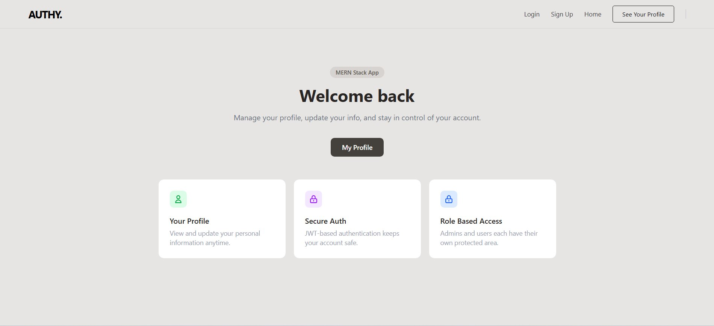
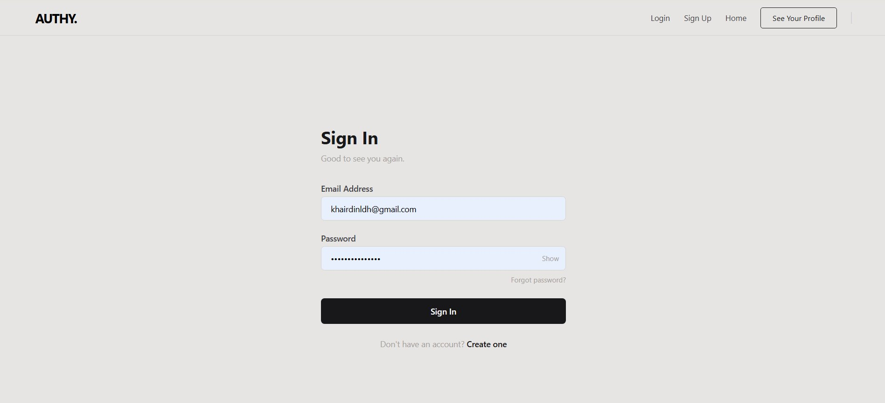
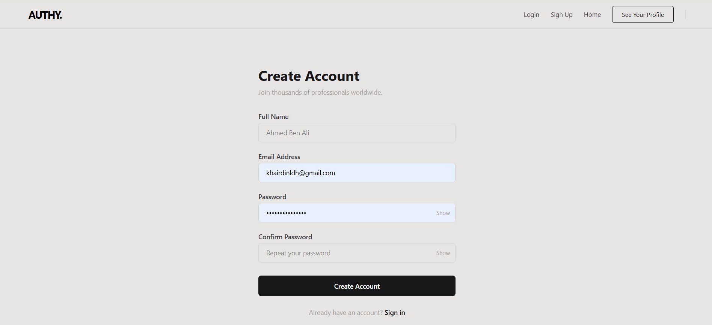
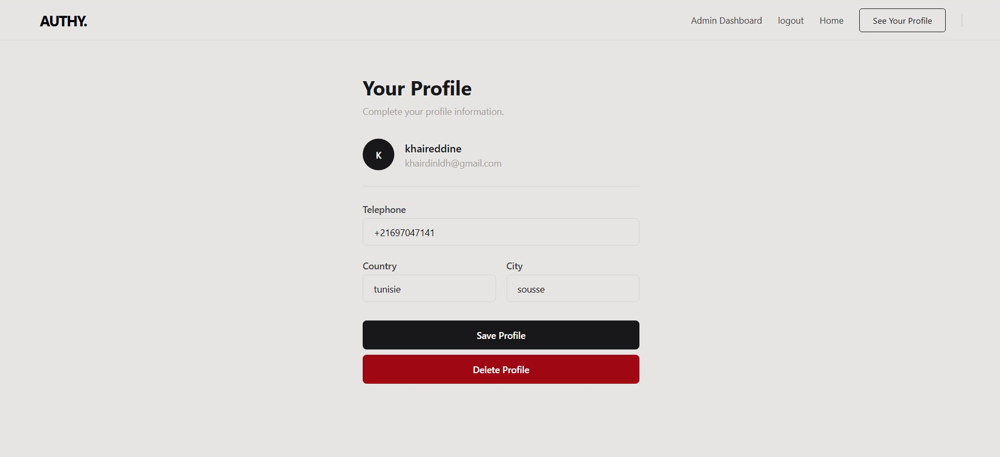
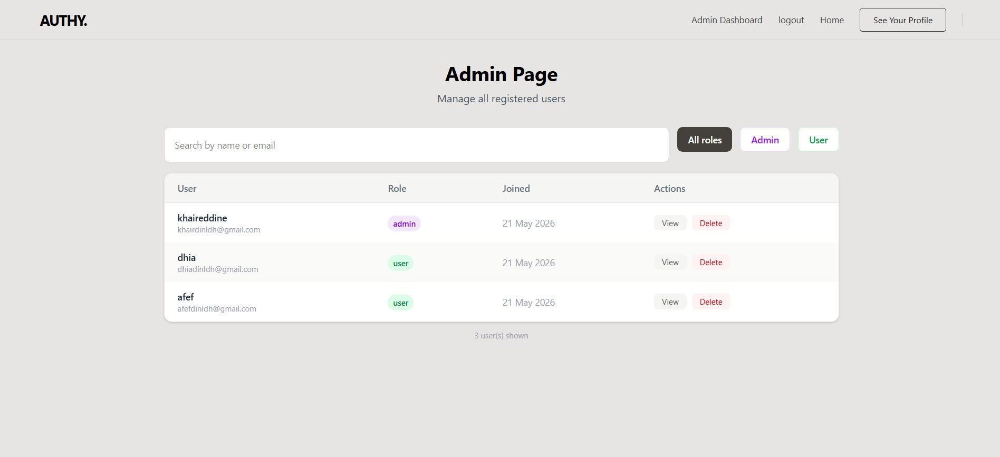
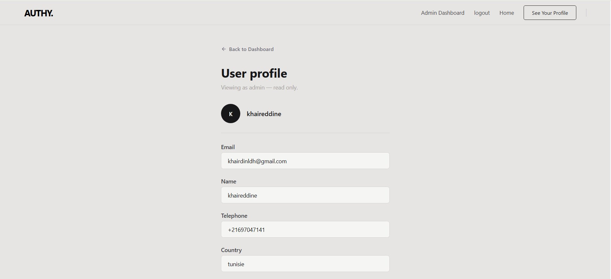

# AUTHY. 🔐


> A secure, production-ready authentication system built with the MERN stack. Features role-based access control, JWT authentication, and a full admin dashboard.

🌐 **Live Demo:** [nexauthproject.netlify.app](https://nexauthproject.netlify.app)  
🔧 **Backend API:** [nexauth-4u1v.onrender.com](https://nexauth-4u1v.onrender.com)



---

## 🛠 Tech Stack

| Layer | Technology |
|-------|-----------|
| Frontend | React 18, Vite, React Router v6, Axios, Tailwind CSS |
| Backend | Node.js, Express.js |
| Database | MongoDB, Mongoose |
| Auth | JWT, Passport.js (passport-jwt), bcrypt |
| Security | Helmet, CORS, express-rate-limit |

---

## ✨ Features

### 🔑 Authentication
- User registration with dual validation (frontend + backend)
- Secure login — JWT stored in **localStorage**
- Auto-restore session on page refresh via `/user` endpoint
- Logout clears token from localStorage

### 👮 Role-Based Access Control
- Two roles: `admin` and `user`
- Protected routes via `passport-jwt` + custom `RolesMiddleware`
- Admin-only navbar links and routes — users are redirected automatically
- `PrivateRouter` and `PrivateRouterAdmin` components protect frontend routes

### 👤 User Profile
- Add, view, update, and delete personal profile info
- Fields: telephone, country, city
- Linked to user account via MongoDB ObjectId reference

### 🛡 Admin Dashboard
- View all registered users with their role and join date
- Filter users by role (All / Admin / User)
- Search users by name or email
- View any user's profile (read-only)
- Delete any user account

---

## 📸 Screenshots

### Home


### Sign In


### Create Account


### User Profile


### Admin Dashboard


### Admin — View User Profile


---

## 🔒 Security Implementation

| Protection | How |
|------------|-----|
| Password hashing | `bcrypt` with salt rounds |
| JWT storage | `localStorage` — token saved on login, cleared on logout |
| Brute force protection | `express-rate-limit` — max 10 requests / 15 min on `/login` and `/register` |
| Security headers | `helmet` — CSP, X-Frame-Options, HSTS, and more |
| CORS | Enabled on all routes to allow frontend communication |
| NoSQL injection | Custom sanitizer strips `$` operators from all inputs |
| Hidden server info | `app.disable("x-powered-by")` |
| Input validation (backend) | `validator` package — email format, password strength, duplicate check |
| Input validation (frontend) | Live client-side checks before any request is sent |
| Role enforcement | Every protected route checks both JWT validity and user role |

---

## 📁 Project Structure

```
appauth/
├── client/                     # React frontend (Vite)
│   └── src/
│       ├── components/
│       │   ├── Login.jsx
│       │   ├── Register.jsx
│       │   ├── Home.jsx
│       │   ├── Profile.jsx
│       │   ├── Admin.jsx
│       │   ├── Showprofilebyadmin.jsx
│       │   ├── navbar.jsx
│       │   ├── Noaccess.jsx
│       │   └── GlobalContext.jsx
│       └── Privacy/
│           ├── PrivateRouter.jsx
│           ├── PrivateRouterAdmin.jsx
│           └── ForceRedirect.jsx
│
└── server/                     # Node.js backend
    ├── Controllers/
    │   ├── userlogin.js
    │   ├── Userregister.js
    │   ├── admin.js
    │   ├── profile.js
    │   └── testRoute.js
    ├── Models/
    │   ├── Users.js
    │   └── Profile.js
    ├── security/
    │   ├── passport.js
    │   └── RolesMiddleware.js
    ├── Validators/
    │   ├── RegisterValidator.js
    │   ├── loginValidator.js
    │   ├── validateaddprofile.js
    │   └── updateProfileValidator.js
    ├── .env
    └── server.js
```

---

## 🗄 Database Models

### User
| Field | Type | Notes |
|-------|------|-------|
| name | String | Required |
| email | String | Unique, lowercase, trimmed |
| password | String | Hashed with bcrypt |
| role | String | Default: `"user"` |
| date | Date | Auto set on creation |

### Profile
| Field | Type | Notes |
|-------|------|-------|
| userId | ObjectId | Ref to Users |
| telephone | String | Required |
| country | String | Lowercase, trimmed |
| city | String | Required |
| date | Date | Auto set on creation |

---

## 🚀 Getting Started

### Prerequisites
- Node.js v18+
- MongoDB (local or Atlas)

### 1. Clone the repo
```bash
git clone https://github.com/YOUR_USERNAME/authy.git
cd authy
```

### 2. Setup the backend
```bash
cd server
npm install
```

Create a `.env` file in `/server`:
```env
PORT=8000
MONGO_URI=your_mongodb_connection_string
JWT_SECRET=your_strong_random_secret_here
```

Generate a strong JWT secret:
```bash
node -e "console.log(require('crypto').randomBytes(64).toString('hex'))"
```

Start the server:
```bash
npm run dev
```

### 3. Setup the frontend
```bash
cd client
npm install
npm run dev
```

### 4. Open the app
```
http://localhost:5173
```

---

## 🌐 API Routes

### Auth
| Method | Route | Access | Description |
|--------|-------|--------|-------------|
| POST | `/register` | Public | Create new account |
| POST | `/login` | Public | Login, returns JWT token |

### User
| Method | Route | Access | Description |
|--------|-------|--------|-------------|
| GET | `/user` | Auth | Get current user info |
| GET | `/test` | Admin + User | Test protected route |

### Profile
| Method | Route | Access | Description |
|--------|-------|--------|-------------|
| POST | `/profile` | Auth | Add profile |
| GET | `/profile` | Auth | View own profile |
| PUT | `/updateprofile` | Auth | Update own profile |
| DELETE | `/deleteprofile` | Auth | Delete own profile |

### Admin
| Method | Route | Access | Description |
|--------|-------|--------|-------------|
| GET | `/admin` | Admin | Admin home |
| GET | `/admin/users` | Admin | List all users |
| GET | `/admin/user/:id` | Admin | View specific user |
| DELETE | `/admin/deleteuser/:id` | Admin | Delete a user |
| GET | `/showprofilebyadmin/:id` | Admin | View user profile |
| GET | `/profiles` | Admin | View all profiles |

---

## 📋 Password Requirements

Validated on both frontend and backend:
- Minimum 8 characters
- At least 1 uppercase letter
- At least 1 lowercase letter
- At least 1 number
- At least 1 symbol (`!@#$%^&*`)

---

## 📦 Backend Packages

```json
express, mongoose, bcrypt, jsonwebtoken, passport, passport-jwt,
cors, helmet, express-rate-limit, validator, dotenv
```

## 📦 Frontend Packages

```json
react, react-dom, react-router-dom, axios, tailwindcss, vite
```

---

## 🚧 Roadmap

- [ ] HTTPS in production (auto via Render/Railway)
- [ ] Email verification on register
- [ ] Refresh token system
- [ ] Account lockout after failed attempts

---

## 👨‍💻 Author

Built by **Khair Eddine Ladhari**  
Stack: MongoDB · Express · React · Node.js

---

> ⭐ If you found this useful, give it a star on GitHub!
